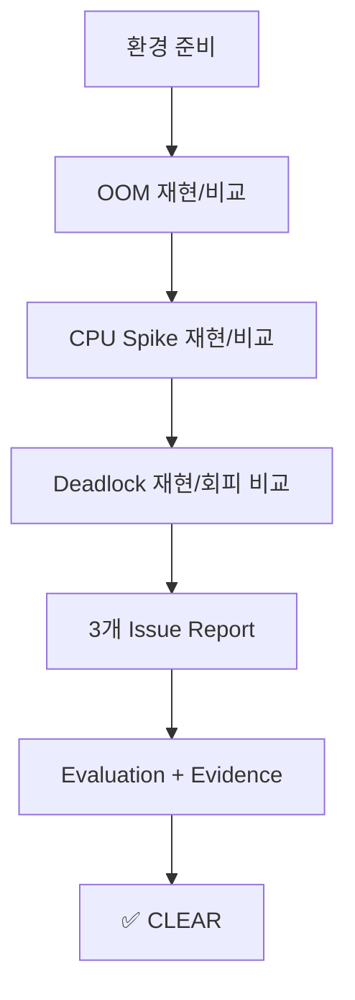
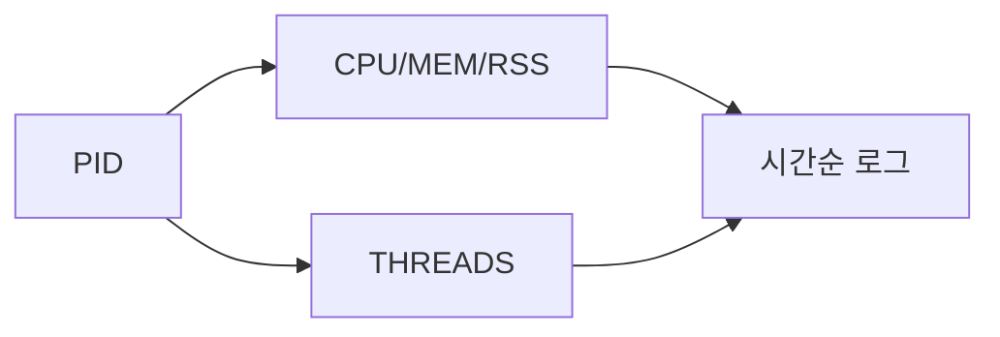
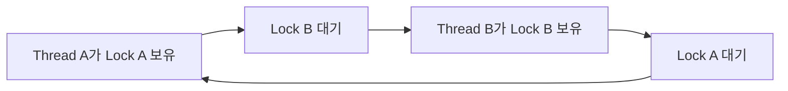

# B1-2 Round 01 — Beginner Guide

이 문서는 B1-2를 공식 Mission/Evaluation 기준으로 처음부터 끝까지 재현하기 위한 Runtime 가이드입니다.

> 현재는 **Phase A — REFERENCE BUILD**입니다. 실제 장애 재현·PID·수치·로그·Before/After Evidence는 Phase C에서만 채웁니다. 예시값은 실제 결과로 간주하지 않습니다.

## 00. 미션 한눈에 보기

- 미션: **B1-2 — 컴퓨터가 갑자기 느려지거나 멈췄을 때 원인 찾아 고치기**
- 분야: Linux와 OS
- 핵심 장애: **Memory Leak/OOM, CPU Spike, Deadlock**
- 최종 결과: GitHub Issue 형식 장애 분석 리포트 3건
- Mission 상태: **⬜ NOT STARTED** — Reference Build만 선제 준비

## 01. Source of Truth

1. `b1-2-mission.pdf`
2. `b1-2-mission.md`
3. `b1-2-evaluation.md`
4. `agent-app-leak.zip`

## 02. 전체 흐름



세 케이스 모두 **재현 → 관찰 → 로그 확인 → 환경변수 조정 → 다시 실행 → Before/After 비교**라는 같은 사고 흐름을 사용합니다.

---

# STEP 01 — 격리된 Runtime과 도구 확인

## ① 왜 하는가

B1-2는 의도적으로 메모리·CPU·스레드 장애를 발생시키므로 공유 운영 서버보다 로컬/격리 환경에서 수행해야 합니다.

## ② 무엇을 하는가

Linux, CPU 아키텍처, 사용 가능 메모리, 중요 명령과 15034 포트 상태를 확인합니다.

## ③ 이번 단계에서 알아야 할 용어

- **장애 재현 (Reproduction)** — 동일 조건에서 문제를 다시 일으켜 원인을 관찰하는 과정입니다.
- **격리 환경 (Isolated Environment)** — 장애 실험이 다른 서비스에 영향을 주지 않는 환경입니다.

## ④ 필요한 핵심 개념

실제 장애 대응은 재부팅부터 하는 것이 아니라 **증거 보존 → 관찰 → 가설 → 조치 → 재검증** 순서가 중요합니다.

## ⑤ 실행할 명령어 또는 코드

```bash
cat /etc/os-release
uname -m
free -h
nproc
ss -lntp | grep ':15034' || true
for c in bash ps top pgrep awk grep sed tee ss unzip file; do command -v "$c" || echo "[MISSING] $c"; done
```

## ⑥ 명령어와 코드에 입문자가 이해할 수 있는 주석

- `free -h`: 현재 호스트의 메모리 여유를 봅니다.
- `nproc`: 사용 가능한 CPU 논리 코어 수를 확인합니다.
- `ss`: Agent가 사용할 15034 포트 충돌 여부를 확인합니다.

## ⑦ 예상되는 정상 결과

필수 명령이 존재하고 15034를 다른 중요 서비스가 사용하지 않습니다.

## ⑧ 그 결과가 의미하는 것

장애 재현을 시작해도 되는 안전한 기본조건을 확인한 것입니다.

## ⑨ 자주 발생하는 오류와 해결 방법

- 15034 사용 중 → 점유 프로세스를 확인하고 중요한 서비스라면 다른 격리 환경 사용
- 메모리 여유 부족 → 다른 앱 종료 또는 더 여유 있는 VM/WSL 사용

## ⑩ 완료 확인

- [ ] 격리 Linux
- [ ] 아키텍처 확인
- [ ] 메모리/CPU 여유 확인
- [ ] 15034 충돌 없음

---

# STEP 02 — 제공 앱·환경변수·Secret 준비

## ① 왜 하는가

agent-leak-app은 정해진 환경변수, 디렉터리, Secret, 포트 조건을 통과해야 장애 시나리오를 시작할 수 있습니다.

## ② 무엇을 하는가

ZIP에서 CPU에 맞는 바이너리를 선택하고, 공통 경로와 Secret을 로컬에서만 준비합니다.

## ③ 이번 단계에서 알아야 할 용어

- **환경변수 (Environment Variable)** — 실행 시 프로그램 행동을 바꾸는 외부 설정값입니다.
- **Secret** — 공개 저장소·로그·Evidence에 남기면 안 되는 민감 값입니다.

## ④ 필요한 핵심 개념

`MEMORY_LIMIT`, `CPU_MAX_OCCUPY`, `MULTI_THREAD_ENABLE`은 소스를 수정하지 않고 장애 조건을 바꾸는 **실험 변수**입니다.

## ⑤ 실행할 명령어 또는 코드

```bash
export AGENT_HOME="$HOME/b1-2-agent"
mkdir -p "$AGENT_HOME/bin" "$AGENT_HOME/upload_files" "$AGENT_HOME/api_keys" "$AGENT_HOME/logs"

rm -rf /tmp/b1-2-agent-extract
mkdir -p /tmp/b1-2-agent-extract
unzip -q agent-app-leak.zip -d /tmp/b1-2-agent-extract
find /tmp/b1-2-agent-extract -type f -maxdepth 3 -exec file {} \;
```

공식 데이터 설명 기준으로 `x86_64`는 x86 실행 파일, `aarch64/arm64`는 arm64 실행 파일을 선택합니다. 실제 ZIP 내부 경로를 확인한 뒤 `<선택파일>`을 바꿉니다.

```bash
install -m 0750 /tmp/b1-2-agent-extract/<선택파일> "$AGENT_HOME/bin/agent-app-leak"
```

공통 환경:

```bash
export AGENT_PORT=15034
export AGENT_UPLOAD_DIR="$AGENT_HOME/upload_files"
export AGENT_KEY_PATH="$AGENT_HOME/api_keys"
export AGENT_LOG_DIR="$AGENT_HOME/logs"
```

Secret은 공식 Mission에서 확인한 값을 로컬에서만 입력합니다.

```bash
read -rsp 'Enter B1-2 mission test key: ' B1_SECRET; echo
printf '%s\n' "$B1_SECRET" > "$AGENT_HOME/api_keys/secret.key"
unset B1_SECRET
chmod 600 "$AGENT_HOME/api_keys/secret.key"
test -s "$AGENT_HOME/api_keys/secret.key" && echo '[PASS] secret.key exists'
```

## ⑥ 명령어와 코드에 입문자가 이해할 수 있는 주석

- `file`: 실행 파일의 CPU 아키텍처를 확인합니다.
- `read -s`: Secret 입력을 화면에 표시하지 않습니다.
- `AGENT_KEY_PATH`: 공식 B1-2에서는 `api_keys` **디렉터리 경로**를 사용합니다.

## ⑦ 예상되는 정상 결과

아키텍처에 맞는 실행 파일과 필수 디렉터리/환경변수가 준비됩니다.

## ⑧ 그 결과가 의미하는 것

이제 세 장애 시나리오에서 실험 변수만 바꾸며 동일 앱을 비교할 수 있습니다.

## ⑨ 자주 발생하는 오류와 해결 방법

- `Exec format error` → 잘못된 CPU 바이너리 선택
- Boot에서 Secret 실패 → 값은 채팅에 보내지 말고 공식 원본을 보고 다시 로컬 입력

## ⑩ 완료 확인

- [ ] 실행 파일 아키텍처 일치
- [ ] 필수 경로 존재
- [ ] Secret 존재/권한 확인, 값 노출 없음

---

# STEP 03 — 진단 monitor.sh 이해와 준비

## ① 왜 하는가

세 장애 모두 시간에 따른 CPU/MEM/RSS/스레드 변화를 같은 형식으로 기록해야 Before/After 비교가 쉬워집니다.

## ② 무엇을 하는가

`training/round-01-clear/monitor.sh`를 사용해 특정 PID를 2초 간격으로 기록합니다.

## ③ 이번 단계에서 알아야 할 용어

- **PID (Process ID)** — 실행 중인 프로세스를 식별하는 번호입니다.
- **RSS (Resident Set Size)** — 실제 물리 메모리에 올라와 있는 프로세스 메모리 크기의 대표 지표입니다.
- **Thread** — 한 프로세스 안에서 실행되는 작업 흐름입니다.

## ④ 필요한 핵심 개념



하나의 수치보다 **시간에 따른 변화 패턴**이 장애 원인 분석에 더 중요합니다.

## ⑤ 실행할 명령어 또는 코드

```bash
chmod +x training/round-01-clear/monitor.sh
bash -n training/round-01-clear/monitor.sh
```

Runtime 사용법:

```bash
training/round-01-clear/monitor.sh <PID> <output-file> 2
```

## ⑥ 명령어와 코드에 입문자가 이해할 수 있는 주석

- `bash -n`: 실행하지 않고 Bash 문법만 검사합니다.
- `ps -L`: 프로세스 내부 스레드를 확인합니다.

## ⑦ 예상되는 정상 결과

`TIMESTAMP PID STAT CPU MEM RSS_KB THREADS ELAPSED`가 시간순으로 기록됩니다.

## ⑧ 그 결과가 의미하는 것

OOM의 메모리 증가, CPU Spike, Deadlock의 정체를 같은 기준으로 비교할 수 있습니다.

## ⑨ 자주 발생하는 오류와 해결 방법

PID를 잘못 넣으면 즉시 EXITED가 기록되므로 앱 실행 직후 `$!` 값을 정확히 사용합니다.

## ⑩ 완료 확인

- [ ] monitor.sh 문법 성공
- [ ] 출력 필드 의미 이해

---

# STEP 04 — OOM/Memory Leak Before 재현

## ① 왜 하는가

메모리 누수는 종료 순간만 보는 것이 아니라 종료 전까지 RSS/MEM이 계속 증가하는 패턴을 증명해야 합니다.

## ② 무엇을 하는가

Memory 실험에 방해되는 CPU/멀티스레드 조건을 완화하고 낮은 `MEMORY_LIMIT` 기준 실행을 수집합니다.

## ③ 이번 단계에서 알아야 할 용어

- **메모리 누수 (Memory Leak)** — 사용이 끝난 메모리가 회수되지 않고 계속 누적되는 현상입니다.
- **MemoryGuard** — 미션 앱이 메모리 한도를 넘을 때 시스템 보호를 위해 종료시키는 정책입니다.

## ④ 필요한 핵심 개념


## ⑤ 실행할 명령어 또는 코드

```bash
mkdir -p training/round-01-clear/evidence/oom
export MEMORY_LIMIT=128
export CPU_MAX_OCCUPY=100
export MULTI_THREAD_ENABLE=false

"$AGENT_HOME/bin/agent-app-leak" \
  > training/round-01-clear/evidence/oom/before-app.log 2>&1 &
APP_PID=$!
echo "$APP_PID" | tee training/round-01-clear/evidence/oom/before-pid.txt

training/round-01-clear/monitor.sh "$APP_PID" \
  training/round-01-clear/evidence/oom/before-monitor.log 2
wait "$APP_PID" || true
```

핵심 로그 검색:

```bash
grep -Ei 'Memory|limit|SELF|terminat|critical' \
  training/round-01-clear/evidence/oom/before-app.log | tail -n 30
```

## ⑥ 명령어와 코드에 입문자가 이해할 수 있는 주석

`$!`은 방금 백그라운드로 실행한 앱 PID입니다. `wait`는 해당 프로세스가 끝날 때까지 기다리며 종료 상태를 수집합니다.

## ⑦ 예상되는 정상 결과

실제 앱 동작에 따라 RSS/MEM이 시간에 따라 증가하고 보호정책 관련 종료 로그가 나타납니다.

## ⑧ 그 결과가 의미하는 것

메모리 사용 증가와 종료 로그가 시간적으로 연결되면 OOM/MemoryGuard 원인 분석의 핵심 증거가 됩니다.

## ⑨ 자주 발생하는 오류와 해결 방법

- CPU Watchdog가 먼저 종료 → CPU 한도와 멀티스레드 조건 확인
- 메모리 증가가 안 보임 → 충분한 관측 시간과 실제 PID 확인

## ⑩ 완료 확인

- [ ] PID
- [ ] 메모리 증가 시계열
- [ ] 종료 직전/직후 로그
- [ ] 보호정책 핵심 메시지

---

# STEP 05 — OOM After와 Before/After 비교

## ① 왜 하는가

공식 요구사항은 `MEMORY_LIMIT`을 바꾸었을 때 더 오래 생존하는지 최소 2회 비교하도록 요구합니다.

## ② 무엇을 하는가

다른 조건은 유지하고 Memory limit만 높여 다시 실행합니다.

## ③ 이번 단계에서 알아야 할 용어

- **통제 변수 (Control Variable)** — 비교 실험에서 바꾸지 않는 조건입니다.
- **Before & After** — 변경 전후를 같은 지표로 비교하는 방식입니다.

## ④ 필요한 핵심 개념

한 번에 하나의 핵심 변수만 바꿔야 변화 원인을 설명하기 쉽습니다.

## ⑤ 실행할 명령어 또는 코드

```bash
export MEMORY_LIMIT=256
export CPU_MAX_OCCUPY=100
export MULTI_THREAD_ENABLE=false

"$AGENT_HOME/bin/agent-app-leak" \
  > training/round-01-clear/evidence/oom/after-app.log 2>&1 &
APP_PID=$!
training/round-01-clear/monitor.sh "$APP_PID" \
  training/round-01-clear/evidence/oom/after-monitor.log 2
wait "$APP_PID" || true
```

비교할 값: 시작/종료 시각, 생존시간, 최대 RSS/MEM, 종료 이유.

## ⑥ 명령어와 코드에 입문자가 이해할 수 있는 주석

`MEMORY_LIMIT=128 → 256`은 예시 Golden Path입니다. 실제 환경 안전 범위와 공식 허용 범위 50~512 안에서 비교합니다.

## ⑦ 예상되는 정상 결과

After의 생존 시간이 Before보다 늘거나 종료 시점/메모리 한도가 달라집니다.

## ⑧ 그 결과가 의미하는 것

환경변수 변경이 증상을 늦추지만 누수 패턴 자체가 지속된다면 임시 조치임을 설명할 수 있습니다.

## ⑨ 자주 발생하는 오류와 해결 방법

After가 더 오래 살지 않으면 다른 종료 원인(CPU Watchdog 등)을 로그에서 확인합니다.

## ⑩ 완료 확인

- [ ] OOM 최소 2회
- [ ] MEMORY_LIMIT 전후 값
- [ ] 생존시간/최대 메모리 비교

---

# STEP 06 — CPU Spike Before/After

## ① 왜 하는가

시스템 전체가 아니라 특정 Agent 프로세스 CPU가 급상승하고 Watchdog가 보호 종료했는지 증명해야 합니다.

## ② 무엇을 하는가

Memory/Deadlock 조건을 완화하고 CPU 임계값만 낮은 값과 높은 값으로 비교합니다.

## ③ 이번 단계에서 알아야 할 용어

- **CPU Spike** — CPU 사용률이 짧은 시간에 급격히 상승하는 현상입니다.
- **Watchdog** — 비정상 상태를 감시하고 보호 조치를 수행하는 감시 로직입니다.

## ④ 필요한 핵심 개념

`PID → CPU 추세 → Watchdog 로그 → 종료`를 하나의 증거 흐름으로 연결합니다.

## ⑤ 실행할 명령어 또는 코드

Before 예시:

```bash
mkdir -p training/round-01-clear/evidence/cpu
export MEMORY_LIMIT=512
export CPU_MAX_OCCUPY=20
export MULTI_THREAD_ENABLE=false

"$AGENT_HOME/bin/agent-app-leak" \
  > training/round-01-clear/evidence/cpu/before-app.log 2>&1 &
APP_PID=$!
training/round-01-clear/monitor.sh "$APP_PID" \
  training/round-01-clear/evidence/cpu/before-monitor.log 2
wait "$APP_PID" || true
```

After 예시:

```bash
export CPU_MAX_OCCUPY=80
"$AGENT_HOME/bin/agent-app-leak" \
  > training/round-01-clear/evidence/cpu/after-app.log 2>&1 &
APP_PID=$!
training/round-01-clear/monitor.sh "$APP_PID" \
  training/round-01-clear/evidence/cpu/after-monitor.log 2
wait "$APP_PID" || true
```

핵심 로그:

```bash
grep -Ei 'WATCHDOG|SIGTERM|CPU|abort|critical' training/round-01-clear/evidence/cpu/*-app.log
```

## ⑥ 명령어와 코드에 입문자가 이해할 수 있는 주석

`CPU_MAX_OCCUPY`는 공식 허용 범위 10~100 안에서 선택합니다. 20/80은 Reference 예시이며 실제 결과는 직접 기록합니다.

## ⑦ 예상되는 정상 결과

낮은 임계값에서 종료가 더 빨리 발생하거나 높은 임계값에서 생존 시간이 달라지는 결과를 관측합니다.

## ⑧ 그 결과가 의미하는 것

특정 프로세스 CPU 과점유와 Watchdog 정책의 관계를 Before/After로 설명할 수 있습니다.

## ⑨ 자주 발생하는 오류와 해결 방법

OOM이 먼저 발생하면 MEMORY_LIMIT, Deadlock이 먼저 발생하면 MULTI_THREAD_ENABLE 조건을 다시 확인합니다.

## ⑩ 완료 확인

- [ ] CPU 급상승 수치
- [ ] Watchdog 핵심 로그
- [ ] CPU_MAX_OCCUPY Before/After
- [ ] 생존/종료 비교

---

# STEP 07 — Deadlock 재현과 스레드 진단

## ① 왜 하는가

Deadlock은 프로세스가 죽지 않고 살아있어 단순 PID 확인만으로는 장애를 찾기 어렵습니다.

## ② 무엇을 하는가

멀티스레드를 켜고 PID 생존, CPU/MEM 정체, 로그 중단, 스레드 상태를 함께 수집합니다.

## ③ 이번 단계에서 알아야 할 용어

- **교착상태 (Deadlock)** — 서로가 가진 자원을 기다리며 아무도 진행하지 못하는 상태입니다.
- **상호 배제 / 순환 대기** — Deadlock을 설명하는 핵심 조건입니다.

## ④ 필요한 핵심 개념



프로세스 생존만으로 정상이라고 판단하지 않고 **진행(progress)이 있는지** 봅니다.

## ⑤ 실행할 명령어 또는 코드

```bash
mkdir -p training/round-01-clear/evidence/deadlock
export MEMORY_LIMIT=512
export CPU_MAX_OCCUPY=100
export MULTI_THREAD_ENABLE=true

"$AGENT_HOME/bin/agent-app-leak" \
  > training/round-01-clear/evidence/deadlock/before-app.log 2>&1 &
APP_PID=$!
echo "$APP_PID" | tee training/round-01-clear/evidence/deadlock/before-pid.txt

training/round-01-clear/monitor.sh "$APP_PID" \
  training/round-01-clear/evidence/deadlock/before-monitor.log 2 &
MON_PID=$!
```

정체가 의심될 때:

```bash
ps -ef | grep '[a]gent-app-leak'
ps -L -p "$APP_PID" -o pid,tid,psr,stat,pcpu,pmem,wchan:24,comm \
  | tee training/round-01-clear/evidence/deadlock/threads.txt

top -H -b -n 1 -p "$APP_PID" \
  > training/round-01-clear/evidence/deadlock/top-threads.txt

tail -n 50 training/round-01-clear/evidence/deadlock/before-app.log
```

증거 수집 후 monitor를 정리합니다.

```bash
kill "$MON_PID" 2>/dev/null || true
```

## ⑥ 명령어와 코드에 입문자가 이해할 수 있는 주석

- `ps -L`: 스레드(TID)별 상태를 봅니다.
- `wchan`: 커널에서 어떤 대기 지점에 있는지 보조적으로 확인합니다.
- `top -H`: 프로세스 내부 스레드 단위 CPU 상태를 봅니다.

## ⑦ 예상되는 정상 결과

PID는 존재하지만 CPU/MEM/로그 진행이 정체되고 마지막 로그에서 WAITING/BLOCKED 또는 자원 대기 단서가 관측됩니다.

## ⑧ 그 결과가 의미하는 것

프로세스가 단순히 느린 것이 아니라 스레드 간 자원 대기로 진행이 멈췄다는 논리적 근거를 만들 수 있습니다.

## ⑨ 자주 발생하는 오류와 해결 방법

- PID가 종료됨 → Deadlock이 아니라 다른 보호정책 종료 가능성 확인
- 로그에 락 관계가 부족함 → `ps -L`은 보조 증거일 뿐 순환 관계를 임의로 꾸며내지 않음

## ⑩ 완료 확인

- [ ] PID 생존
- [ ] CPU/MEM 정체
- [ ] 스레드 출력
- [ ] 로그 중단 시각
- [ ] WAITING/BLOCKED/순환 대기 근거

---

# STEP 08 — Deadlock 회피 After 비교

## ① 왜 하는가

공식 요구사항은 `MULTI_THREAD_ENABLE` 조정으로 Deadlock 재현/회피 결과를 비교하도록 요구합니다.

## ② 무엇을 하는가

멀티스레드만 false로 바꾸고 나머지 조건을 유지해 재실행합니다.

## ③ 이번 단계에서 알아야 할 용어

- **회피 (Workaround/Avoidance)** — 근본 결함을 수정하지 않고 문제 조건을 피하는 임시 방법입니다.

## ④ 필요한 핵심 개념

멀티스레드를 끄면 순환 락 경쟁 조건이 사라질 수 있지만 기능/성능을 희생할 수 있어 근본 해결과는 다릅니다.

## ⑤ 실행할 명령어 또는 코드

먼저 Before 앱을 정상 종료합니다.

```bash
kill "$APP_PID" 2>/dev/null || true
wait "$APP_PID" 2>/dev/null || true
```

After:

```bash
export MULTI_THREAD_ENABLE=false
"$AGENT_HOME/bin/agent-app-leak" \
  > training/round-01-clear/evidence/deadlock/after-app.log 2>&1 &
APP_PID=$!
training/round-01-clear/monitor.sh "$APP_PID" \
  training/round-01-clear/evidence/deadlock/after-monitor.log 2
```

## ⑥ 명령어와 코드에 입문자가 이해할 수 있는 주석

Before와 After에서 MEMORY_LIMIT/CPU_MAX_OCCUPY를 동일하게 유지해 멀티스레드 변경 효과를 분리합니다.

## ⑦ 예상되는 정상 결과

After에서 로그가 계속 진행되고 Deadlock 정체가 재현되지 않는지 확인합니다.

## ⑧ 그 결과가 의미하는 것

Deadlock 조건과 멀티스레드 동작 사이의 관계를 비교할 수 있습니다.

## ⑨ 자주 발생하는 오류와 해결 방법

다른 보호정책 종료가 발생하면 원인을 분리하고 해당 실행을 Deadlock 비교 증거로 사용하지 않습니다.

## ⑩ 완료 확인

- [ ] MULTI_THREAD_ENABLE 전후
- [ ] Deadlock 재현/회피 비교
- [ ] 근본 해결과 임시 회피를 구분

---

# STEP 09 — 3개 Issue 리포트 완성

## ① 왜 하는가

장애 대응의 마지막은 개인 기억이 아니라 동료가 재현·검토할 수 있는 기술 리포트입니다.

## ② 무엇을 하는가

`oom-report.md`, `cpu-report.md`, `deadlock-report.md`의 `TODO_RUNTIME`을 실제 Evidence로 교체합니다.

## ③ 이번 단계에서 알아야 할 용어

- **Root Cause Analysis (근본 원인 분석)** — 관측된 현상을 만든 기술적 원인을 증거로 설명하는 과정입니다.
- **Workaround** — 당장 증상을 줄이는 임시 조치입니다.

## ④ 필요한 핵심 개념

세 리포트 모두 `현상 → 증거 → 원인 → 조치 → Before/After` 구조를 유지합니다.

## ⑤ 실행할 명령어 또는 코드

```bash
grep -R 'TODO_RUNTIME' training/round-01-clear/docs/*-report.md
```

실제 내용을 모두 채운 뒤 결과가 없어야 합니다.

## ⑥ 명령어와 코드에 입문자가 이해할 수 있는 주석

`grep -R`은 아직 남은 Runtime placeholder를 찾는 검증용입니다.

## ⑦ 예상되는 정상 결과

세 리포트에 PID, 타임스탬프, 핵심 로그, 실제 수치와 Before/After 비교가 존재합니다.

## ⑧ 그 결과가 의미하는 것

평가자가 각 장애의 재현과 조치 과정을 Evidence로 추적할 수 있습니다.

## ⑨ 자주 발생하는 오류와 해결 방법

예시 문구를 실제 증거처럼 사용하지 않습니다. 실제 로그가 부족하면 다시 재현해 Evidence를 보강합니다.

## ⑩ 완료 확인

- [ ] OOM report
- [ ] CPU report
- [ ] Deadlock report
- [ ] 모든 TODO_RUNTIME 제거는 실제 Evidence로만 수행

---

# STEP 10 — verify / Evaluation / CLEAR

## ① 왜 하는가

요구사항 누락, Secret 노출, 리포트 미완성을 마지막에 한 번에 확인합니다.

## ② 무엇을 하는가

Reference 검증 후 Runtime 검증을 수행하고 Evaluation Q&A를 자신의 결과로 설명합니다.

## ③ 이번 단계에서 알아야 할 용어

- **Verification** — 요구사항 충족 여부 확인
- **Evidence** — 실제 충족을 증명하는 자료

## ④ 필요한 핵심 개념

Reference 파일이 있다는 것과 실제 장애를 재현했다는 것은 다릅니다. Runtime 3케이스가 모두 실제로 완료되어야 CLEAR입니다.

## ⑤ 실행할 명령어 또는 코드

Reference 구조:

```bash
bash training/round-01-clear/environment/verify.sh
```

Runtime 이후:

```bash
bash training/round-01-clear/environment/verify.sh --runtime
```

## ⑥ 명령어와 코드에 입문자가 이해할 수 있는 주석

Runtime 모드는 세 Evidence 폴더와 리포트 placeholder까지 확인합니다.

## ⑦ 예상되는 정상 결과

최종적으로 `Result: N PASS / 0 FAIL`과 실제 리포트 3건, 실제 Evidence가 준비됩니다.

## ⑧ 그 결과가 의미하는 것

자동 확인 가능한 요구사항과 실제 분석 산출물이 모두 준비된 것입니다.

## ⑨ 자주 발생하는 오류와 해결 방법

FAIL 항목만 해당 Step으로 돌아가 보완합니다. 미검증 항목을 임의로 PASS 처리하지 않습니다.

## ⑩ 완료 확인

- [ ] OOM 실제 재현/비교
- [ ] CPU 실제 재현/비교
- [ ] Deadlock 실제 재현/회피
- [ ] 3개 리포트
- [ ] Evaluation 설명 가능
- [ ] Secret 노출 없음
- [ ] **✅ B1-2 CLEAR**

---

## 보조 문서

- `REFERENCE-BUILD.md`
- `monitor.sh`
- `environment/README.md`
- `environment/verify.sh`
- `docs/issue-template.md`
- `docs/oom-report.md`
- `docs/cpu-report.md`
- `docs/deadlock-report.md`
- `docs/requirements-mapping.md`
- `docs/evaluation-qa.md`
- `evidence/README.md`
